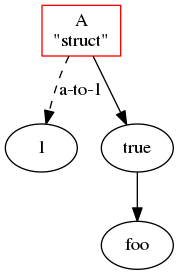
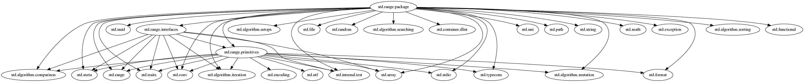

# d-graphviz

[](https://travis-ci.org/ShigekiKarita/d-graphviz)
[](https://codecov.io/gh/ShigekiKarita/d-graphviz)
[](https://code.dlang.org/packages/d-graphviz)

Graphviz utility for D



created by

```d
import std.stdio;
import std.format;

import dgraphviz;

struct A {
    auto toString() {
        return "A\n\"struct\"";
    }
}

void main()
{
    auto g = new Directed;
    A a;
    with (g) {
        node(a, ["shape": "box", "color": "#ff0000"]);
        edge(a, true);
        edge(a, 1, ["style": "dashed", "label": "a-to-1"]);
        edge(true, "foo");
    }
    g.save("simple.dot");
}
```

and `$ dot simple.dot -Tpng -O`


## practical example

library dependency graph

```d
import std.path;
import std.process;
import dgraphviz;

void main() {
    // set phobos root
    auto dc = environment.get("DC");
    assert(dc != "", "use DUB or set $DC enviroment variable");
    auto which = executeShell("which " ~ dc);
    assert(which.status == 0);
    version(DigitalMars) {
        auto root = which.output.dirName ~ "/../../src/phobos/";
    }
    version(LDC) {
        auto root = which.output.dirName ~ "/../import/";
    }

    // plot std.range dependency graph
    auto g = libraryDependency(root, "std/range", true);
    g.save("range.dot");
}
```

result `$ dot range.dot -Tpng -O`



## TODO

- use set ops to remove duplicated nodes and edges
- do string sanity check
- support subgraph
