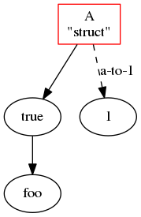

# d-graphviz

Graphviz utility for D



created by

```d
import std.stdio;
import std.format;

static import dot;

struct A {
    auto toString() {
        return "A\n\"struct\"";
    }
}

void main()
{
    auto g = new dot.Directed;
    A a;
    with (g) {
        node(a, ["shape": "box", "color": "#ff0000"]);
        edge(a, true);
        edge(a, 1, ["style": "dashed", "label": "a-to-1"]);
        edge(true, "foo");
    }
    g.save("test.dot");
}
```

and `$ dot test.dot -Tpng > test.png`

## TODO

- use set ops to remove duplicated nodes and edges
- do string sanity check
- support subgraph
